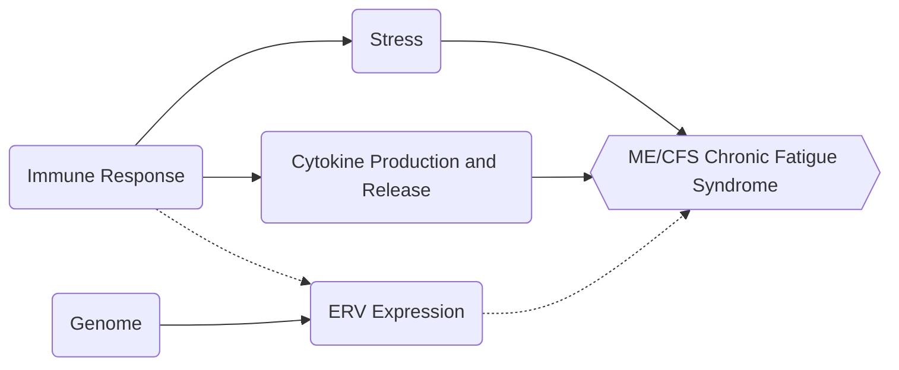

# Sophie Kogut HW1

## Header

### Header

#### Header

##### Header

###### Header

*Italics is one asterisk*

**bold is two** and no spaces

## Un-ordered list

* purple
* yellow
* blue

## Ordered list

1. first 
2. second
3. third


## Manual line breaks

creating a line 
break
Using shift+ return. May also leave 2 spaces at the end of the line, or <br/>

## Links

Typora Cheatsheet: [TyporaCS](https://support.typora.io/Markdown-Reference/#links)

For references, [reference][citation]

## Images

importing images

Use ! [text] (file path to image) with NO SPACES


## Blockquotes

> block quoting
>
> > similar to email 
> >
> > > using the > symbol to push text to the right

## Plain code blocks?

```
function test(){
console.log("notice the blank line before this function?");
}
```

use 3 ` to do fencing

```

```

## R code blocks

``` R
library()
```

Same as plain except you specify R as the language 

## Inline block?

` Use the function()`

## Inline LaTeX equation

$$ E=mc^2 $$

typing two dollar signs before & after without pressing enter

## Centered LaTeX equation

$$
E= mc^2
$$

## Horizontal Rule

***

Using *** or ---

---

## Simple Table

| Header.1 | Header.2 | A    |
| -------- | -------- | ---- |
| 1        | 4        | 1.1  |
| 2        | 5        | 2.2  |
| 3        | 6        | 3.3  |

### Flowchart


Created using mermaid




